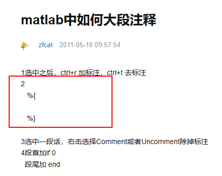

# Matlab日常记录

- 
- 想要读取文件夹中某个.m文件并直接赋值给某个变量时，用load做不到，可以用importdata，例如：ls=importdata(‘a.mat’)
- 求某个数的所有公约数，可以用一下代码：a=1:400;bc=a(mod(400,a)==0)，则bc是保存了400的所有公约数


---

# SCI论文写作


---

# latex日常记录

- ```latex
  \begin{enumerate}
  	\item[]<+->   %item默认有编号，加[]后没编号，编号位置为[]中内容，如[*]
  	\item[]<+->   %<+->可以让item还没轮到的部分变为浅灰色
  \end{enumerate}
  ```

- fontawesome图标，首先，调用package：

  ```latex
  \usepackage{fontawesome}
  ```

  fontawesome图标的细节，可以参考： [fontawesome.pdf](file\fontawesome.pdf) 

- latex字体配色，可以选择一些看了舒服的颜色，如：\usepackage{color} \textcolor[rgb]{0.5,0.6,0.7}{文字}，颜色参数范围为[0,1]，颜色参考： [最舒服的色彩搭配RGB值配色.pdf](file\最舒服的色彩搭配RGB值配色.pdf) 


---

# 系统和程序的安装和配置

## ubuntu

 [Ubuntu Server 16.04服务器版安装图解教程.pdf](file\Ubuntu Server 16.04服务器版安装图解教程.pdf) 

 [Win10开启FTP与配置（完整无错版）.pdf](file\Win10开启FTP与配置（完整无错版）.pdf) 

 [win10-iis搭建web服务器.pdf](file\win10-iis搭建web服务器.pdf) 


# bootstrap

初始模板

- 用到的css，js及其他文件：

  [bootstrap-4.0.0-dist](file/learn-bootstrap/bootstrap-4.0.0-dist)

- 初始模板：

   [index.html](file\learn-bootstrap\index.html) 

配色

- 知识点：text-*  bg-*

  

  

文本样式

- 知识点：text-*  font-*

  
  
  
  
  
  ```html
      <h2 class="font-weight-normal display-1">Bootstrap4教学</h2>
      <div class="bg-light">欢迎收看《小马技术视频》</div>
      <div class="text-center bg-info font-weight-bold">欢迎收看《小马技术视频》</div>
      <div class="text-left bg-light">欢迎收看《小马技术视频》</div>
      <div class="text-right bg-dark text-white">欢迎收看《小马技术视频》</div>
  ```

元素size

- 知识点： w-*  h-*      -后面的数字指的是百分比

  

  

padding和margin的使用

- 知识点：

  ```html
  [p|m][locaton]-[size]
  ```

  

  

  

vscode中，代码整形快捷键：shift+alt+F

按钮

- 知识点：btn-* 

  

  

  

网格系统

- 知识点：col-*    12列布局


---

# git


